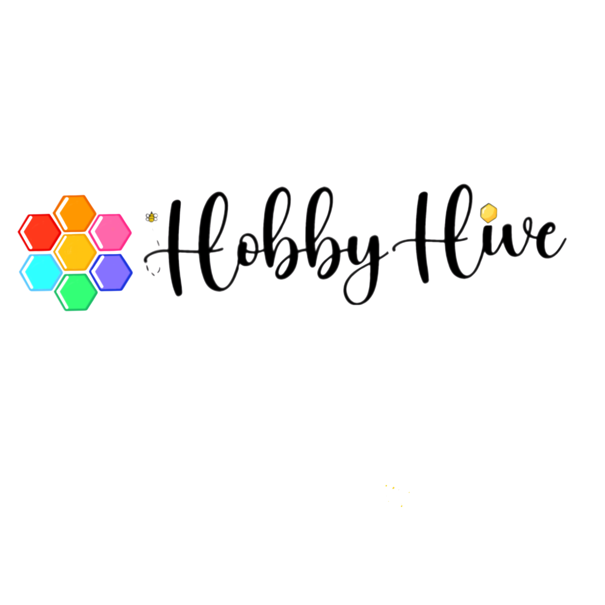

<!-- Improved compatibility of back to top link: See: https://github.com/othneildrew/Best-README-Template/pull/73 -->
<a id="readme-top"></a>
<!--
*** Thanks for checking out the Best-README-Template. If you have a suggestion
*** that would make this better, please fork the repo and create a pull request
*** or simply open an issue with the tag "enhancement".
*** Don't forget to give the project a star!
*** Thanks again! Now go create something AMAZING! :D
-->


<!-- PROJECT SHIELDS -->
<!--
*** I'm using markdown "reference style" links for readability.
*** Reference links are enclosed in brackets [ ] instead of parentheses ( ).
*** See the bottom of this document for the declaration of the reference variables
*** for contributors-url, forks-url, etc. This is an optional, concise syntax you may use.
*** https://www.markdownguide.org/basic-syntax/#reference-style-links
-->


<!-- PROJECT LOGO -->
<br />
<div align="center">
  <a href="https://github.com/Kunxl-4568/Team_Project">
    
  </a>

<h3 align="center"> HobbyHive </h3>

  <p align="center">
    HobbyHive is a DIY-focused ecommerce platform built to help people get creative.
    We’re offering a wide range of hands-on projects, tools, and kits so users can discover new hobbies, learn new skills, and make things they’re genuinely proud of. It’s all about inspiring creativity, and giving makers a space to explore whatever they feel like building next.
    <br />
    <br />
  </p>
</div>


<!-- TABLE OF CONTENTS -->
<details>
  <summary>Table of Contents</summary>
  <ol>
    <li>
      <a href="#about-the-project">About The Project</a>
      <ul>
        <li><a href="#built-with">Built With</a></li>
      </ul>
    </li>
    <li>
      <a href="#getting-started">Getting Started</a>
      <ul>
        <li><a href="#installation">Installation</a></li>
      </ul>
    </li>
    <li><a href="#usage">Usage</a></li>
    <li><a href="#roadmap">Roadmap</a></li>
    <li><a href="#license">License</a></li>
  </ol>
</details>


<!-- ABOUT THE PROJECT -->
## About The Project

[![Product Name Screen Shot][product-screenshot]](https://example.com)

HobbyHive is a place where people can tap into their creativity and explore hands-on projects that actually interest them. Whether someone’s into crafts, building, painting, or trying something completely new, the site brings together a wide range of kits, tools, and ideas to make getting started easy.

We’re building a space where beginners and hobby veterans can explore, learn, and pick up everything they need in one place. The goal is simple: make creativity accessible, fun, and something anyone can jump into without stress.

HobbyHive isn’t just a shop, it’s a hub of creativity!

<p align="right">(<a href="#readme-top">back to top</a>)</p>


### Built With

* [![Node][Node.js]][Node-url]
* [![React][React.js]][React-url]
* [![Laravel][Laravel.com]][Laravel-url]
* [![Tailwind][Tailwind.com]][Tailwind-url]
* [![Composer][Composer.com]][Composer-url]


<p align="right">(<a href="#readme-top">back to top</a>)</p>


<!-- GETTING STARTED -->
## Getting Started

All of the following are needed for setup on your system:

Git > https://git-scm.com/downloads

(You’ll need this to clone our repository.)

PHP >  https://www.php.net/downloads / https://www.apachefriends.org/download.html 

(Xampp or native PHP is fine for this.)

Composer > https://getcomposer.org/download/

(Follow the instructions here carefully.)

Node.js > https://nodejs.org/en/download

NOTE: If an ADD TO PATH option is available, make sure it is checked for each install.


### Installation


1. Clone the repo
   ```sh
    git clone https://github.com/Kunxl-4568/Team_Project_draft
    cd Team_Project_draft/HobbyHive

   ```
3. Install Composer within the Repo Folder
   ```sh
   composer install
   composer -v #will return a version number if its installed correctly
   ```


4. Install NPM within the Repo Folder
   ```sh
   npm install
   npm -v
   ```

5. Set Up Environment
   ```sh
   cp .env.example .env
   php artisan key:generate

   ```

6. Create Database
    ```sh
    php artisan migrate
    ```

7. Starting your local server
     ```sh
    composer run dev 
    ```


    

<p align="right">(<a href="#readme-top">back to top</a>)</p>


<!-- ROADMAP -->
## Roadmap

- [ ] Chatbot
- [ ] Wishlist
- [ ] Product Search


<p align="right">(<a href="#readme-top">back to top</a>)</p>


<!-- LICENSE -->
## License

See `LICENSE.txt` for more information.

<p align="right">(<a href="#readme-top">back to top</a>)</p>


<!-- MARKDOWN LINKS & IMAGES -->
<!-- https://www.markdownguide.org/basic-syntax/#reference-style-links -->
[contributors-shield]: https://img.shields.io/github/contributors/github_username/repo_name.svg?style=for-the-badge
[contributors-url]: https://github.com/github_username/repo_name/graphs/contributors
[forks-shield]: https://img.shields.io/github/forks/github_username/repo_name.svg?style=for-the-badge
[forks-url]: https://github.com/github_username/repo_name/network/members
[stars-shield]: https://img.shields.io/github/stars/github_username/repo_name.svg?style=for-the-badge
[stars-url]: https://github.com/github_username/repo_name/stargazers
[issues-shield]: https://img.shields.io/github/issues/github_username/repo_name.svg?style=for-the-badge
[issues-url]: https://github.com/github_username/repo_name/issues
[license-shield]: https://img.shields.io/github/license/github_username/repo_name.svg?style=for-the-badge
[license-url]: https://github.com/github_username/repo_name/blob/master/LICENSE.txt
[linkedin-shield]: https://img.shields.io/badge/-LinkedIn-black.svg?style=for-the-badge&logo=linkedin&colorB=555
[linkedin-url]: https://linkedin.com/in/linkedin_username
[product-screenshot]: images/screenshot.png
<!-- Shields.io badges. You can a comprehensive list with many more badges at: https://github.com/inttter/md-badges -->
[Next.js]: https://img.shields.io/badge/next.js-000000?style=for-the-badge&logo=nextdotjs&logoColor=white
[Next-url]: https://nextjs.org/
[React.js]: https://img.shields.io/badge/React-20232A?style=for-the-badge&logo=react&logoColor=61DAFB
[React-url]: https://reactjs.org/
[Vue.js]: https://img.shields.io/badge/Vue.js-35495E?style=for-the-badge&logo=vuedotjs&logoColor=4FC08D
[Vue-url]: https://vuejs.org/
[Angular.io]: https://img.shields.io/badge/Angular-DD0031?style=for-the-badge&logo=angular&logoColor=white
[Angular-url]: https://angular.io/
[Svelte.dev]: https://img.shields.io/badge/Svelte-4A4A55?style=for-the-badge&logo=svelte&logoColor=FF3E00
[Svelte-url]: https://svelte.dev/
[Laravel.com]: https://img.shields.io/badge/Laravel-FF2D20?style=for-the-badge&logo=laravel&logoColor=white
[Laravel-url]: https://laravel.com
[Tailwind.com]: https://img.shields.io/badge/Tailwind%20CSS-%2338B2AC.svg?logo=tailwind-css&logoColor=white
[Tailwind-url]: https://tailwindcss.com
[Bootstrap.com]: https://img.shields.io/badge/Bootstrap-563D7C?style=for-the-badge&logo=bootstrap&logoColor=white
[Bootstrap-url]: https://getbootstrap.com
[JQuery.com]: https://img.shields.io/badge/jQuery-0769AD?style=for-the-badge&logo=jquery&logoColor=white
[JQuery-url]: https://jquery.com 
[Node.js]: https://img.shields.io/badge/Node.js-6DA55F?logo=node.js&logoColor=white
[Node-url]: https://nodejs.org/en
[Composer.com]: https://img.shields.io/badge/Composer-885630?logo=composer&logoColor=fff
[Composer-url]: https://getcomposer.org